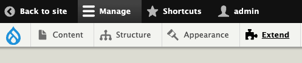
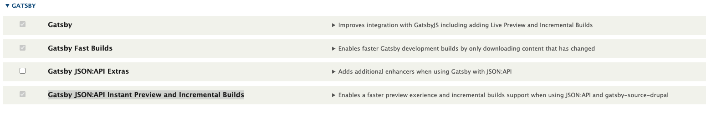
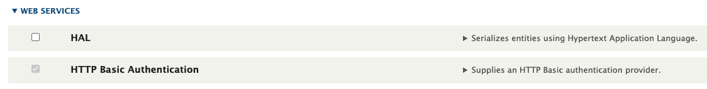
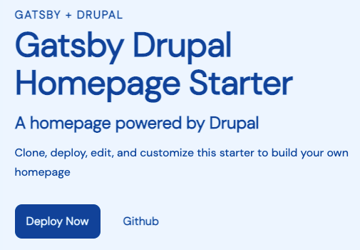
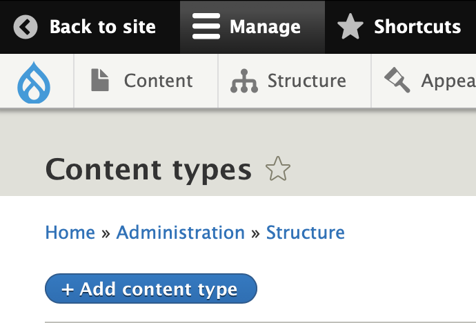
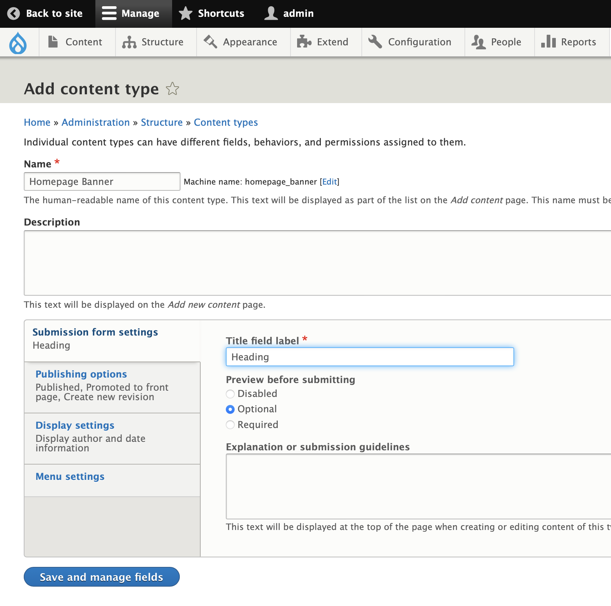
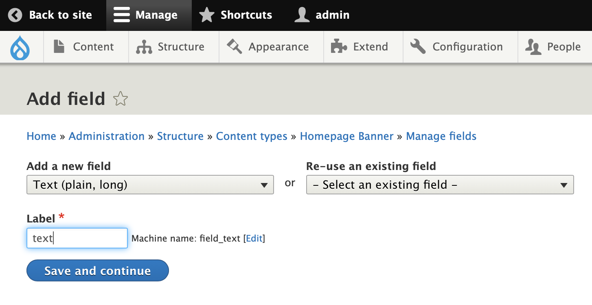
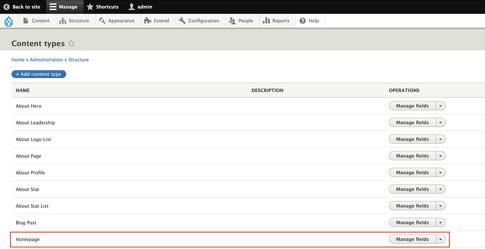
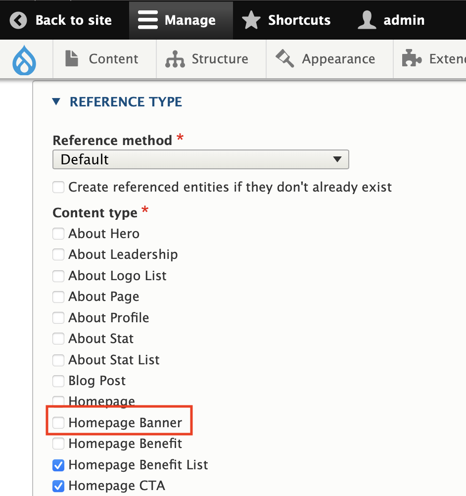
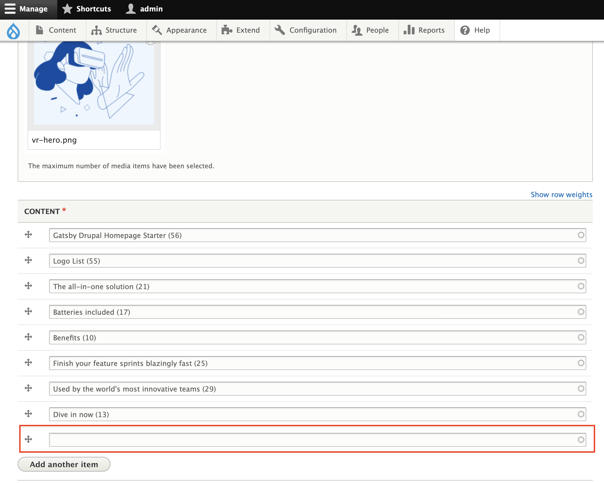

<header style="display: flex; align-items: center;">
   <a href="https://www.gatsbyjs.com">
   
   </a>
   <span style="color: white; font-size: 2rem;">&nbsp; & &nbsp;</span>
   <a href="https://www.drupal.org/">
   
   </a>
</header>


# Gatsby Starter Drupal Homepage, with DOCKER.

Create a homepage using Gatsby and Drupal. This starter demonstrates how to use Drupal to build a homepage and can be customized to match your own visual branding.

[View the live Demo of the original Author](https://gatsbydrupalhomepage.gatsbyjs.io/)

This is forked from https://github.com/gatsbyjs/gatsby-starter-drupal-homepage so see this for more.

**Note:**
This version of the Drupal homepage starter is written in JavaScript. If you want to use Drupal but TypeScript is more your style, there is also a TypeScript version maintained on [GitHub](https://github.com/gatsbyjs/gatsby-starter-drupal-homepage-ts).

## Quick start

You will need a new or existing `Drupal` website to use this starter and will be asked for your `baseUrl` and the `username` and `password` for your `Drupal` during installation.

**If you don't have a Drupal site yet, scroll down to the DOCKER section.**
   ```sh
   # Once Drupal is running:
   cd gatsby
   yarn install
   yarn start
   ```

1. **Create a Gatsby site if you don't want to use the one provided in "Gatsby" folder**

   Use the Gatsby CLI to get started locally:

   ```sh repo
   npx gatsby new gatsby-homepage https://github.com/gatsbyjs/gatsby-starter-drupal-homepage
   ```

1. **Import content to your Drupal instance**

   For this implementation we used **DOCKER** as our local host. So some configurations may be specific to that platform. Before importing the sql dump file we recommend extracting and adding the files located in **`data/files.zip`** extracted to "files_dev", to your drupal site under **`sites/default/files`** or wherever your files folder is located on your instance. Afterwards you may use the **sql** dump file provided in the same **data** directory called **`homepage-starter-dump.sql.gz`**. Depending on the setup, you may have to extract the sql file to your drupal folder before trying to import the data.

   An **admin** user already exists in the application. You will have to reset the password if you decide to start from a clean site.

```sh
# Drush 9
drush user:password admin "admin"

# Drush 8 & earlier
drush user-password admin --password="admin"
```

All the modules should now be installed and activated. To ensure that they are all installed correctly:

1. Go to your local **Drupal** site and login.

1. Select _Extend_ in the toolbar.

   


1. Find the **Gatsby Section** and check **_Gatsby_**, **_Gatsby Fast Builds_**, **_Gatsby JSON\:API Instant Preview and Incremental Builds_**.
All other dependent modules will automatically be installed.

   


1. Find the **Web Services Section** and ensure that **_HTTP Basic Authentication_** is checked.

   


1. Head to the bottom on the page and click the **Install** button.

1. Now you're done in your Drupal site! But we have one more step remaining to connect to your Gatsby homepage site.

1. **Run the setup script**

After setting up the Drupal site, navigate back to your Gatsby site's root directory and run:

```sh
yarn setup

# In this example case the password and URL would be...
1. DRUPAL_BASE_URL=
```
http://nginx-drupal.docker.amazee.io/
```
2. DRUPAL_BASIC_AUTH_USERNAME="admin"
3. DRUPAL_BASIC_AUTH_PASSWORD="admin"
```

This will run a script to create `.env.development` and `.env.production` files for you populated with your Drupal site environment variables.

---

## DOCKER (Locally)
This demo uses Pygmy and Docker:
See https://github.com/pygmystack/pygmy

[See the Lagoon docs](https://docs.lagoon.sh/using-lagoon-the-basics/local-development-environments/).

[See the Docker Getting started Docs](https://docs.docker.com/get-started/)

```sh
# pygmy is written in Golang, so to install it, run:
brew tap pygmystack/pygmy && brew install pygmy
# Once installed run
pygmy up
# If it errors, run `pygmy up` again
```
The required dockerfiles are provided.

## In Docker Dashboard Settings, make sure "Use Docker Composer version 2" is Not Enabled!
```sh
cd drupal
# Start Docker (this will build the containers if you haven't yet)
docker-compose up -d
# ssh into the container
docker-compose exec cli bash
# Run composer install
composer install --prefer-dist --no-dev
# This will destroy the database and import the data.
# If you wish to keep you existing data add the --no-wipe flag.
cd web
drush sqlc < ../homepage-starter-dump.sql (or the path of the extracted homepage-starter-dump.sql)
```

The **composer.json** file as well as exported configurations found in the **config** folder are also included. If you decide to import and install these configurations, please do so before executing the **sql** script and be sure **not** to clean the existing database.

```sh
# import configurations
drush cim #this should be the same
```

Visit your docker site:
http://nginx-drupal.docker.amazee.io/

## Start developing
1. **Start Gatsby**

   In your site directory, start the development server:

   ```sh
   yarn start
   ```

   Your site should now be running at <http://localhost:8000>

1. **Open the source code and start editing**


___


**The following content is all from https://github.com/gatsbyjs/gatsby-starter-drupal-homepage.**


## Setting up Gatsby Cloud Preview

To enable Gatsby Preview with this site, see the documentation for:

[Configuring for Live Preview](https://www.gatsbyjs.com/docs/how-to/sourcing-data/sourcing-from-drupal/#configuring-gatsby-live-preview)

[Installing Gatsby Module for Drupal](https://www.drupal.org/project/gatsby)

[Drupal FastBuilds](https://support.gatsbyjs.com/hc/en-us/articles/1500008011822-Drupal-Fastbuilds-with-Gatsby-Cloud)

## What's included?

```sh
├── README.md
├── gatsby-config.js
├── gatsby-node.js
├── src
│   ├── components
│   ├── pages
│   ├── colors.css.ts
│   ├── styles.css.ts
│   └── theme.css.ts
└── .env.EXAMPLE
```

1. **`gatsby-config.js`**: [Gatsby config][] file that includes plugins required for this starter.
1. **`gatsby-node.js`**: [Gatsby Node][] config file that creates an abstract data model for the homepage content.
1. **`src/`**: The source directory for the starter, including pages, components, and [Vanilla Extract][] files for styling.

[gatsby config]: https://www.gatsbyjs.com/docs/reference/config-files/gatsby-config/
[gatsby node]: https://www.gatsbyjs.com/docs/reference/config-files/gatsby-node/
[vanilla extract]: https://vanilla-extract.style/

## How to

### Update the color theme

To update the colors used in this starter, edit the `src/colors.css.ts` file.

```.ts
// src/colors.css.ts
export const colors = {
  background: "#eff6ff",
  text: "#004ca3",
  primary: "#004ca3",
  muted: "#e6f1ff",
  active: "#001d3d",
  black: "#000",
}

```

If you'd like to add additional colors, add additional keys to this object.
This file is imported into `src/theme.css.ts` and creates CSS custom properties, that can be imported and used in other `.css.ts` files.

The UI components file `src/components/ui.js` imports styles from `src/components/ui.css.ts`. You can see how the theme and color values are being used in this file.

### Add your logo


Replace the `src/components/brand-logo.js` component with your own brand logo.
If you have an SVG version, it can be rendered inline as a React component, following the example in this file. Note that SVG attributes will need to be camel cased for JSX.

Using an inline SVG for the logo allows it to pick up the colors used in CSS, which is how the logo colors are inverted for the mobile menu.

If you prefer to use an image, use the [`StaticImage`](https://www.gatsbyjs.com/docs/reference/built-in-components/gatsby-plugin-image/#staticimage) component from `gatsby-plugin-image` in place of the SVG in this file.

### Customize headings, buttons, and other styles



To further customize the look and feel of the homepage, edit the UI components in `src/components/ui.js` and styles in `src/components/ui.css.ts`.

### Customize section components

To customize any of the sections of the homepage, edit the relevant component in `src/components`.
Most of the styles for these components are handled with shared UI components in `src/components/ui.js`.

### Create custom section components

To create a new type of section in your homepage, you'll want to create a new section component, using the existing components as an example.
For this example, we'll create a new "Banner" component.

1. First, update your content model in Drupal

   1. In your Drupal website, create a new content type and call it "Homepage Banner".

      

   1. For this example, change the _Title_ field's name to _Heading_ in when creating your new content type. Remove any fields that are added dy default and create a new field called `text` this should be of `Text (plain, long)` data type or use an existing field with the same type and field name.

      

      

   1. Find the content type for `Homepage` click _Manage fields_ and edit the settings for the `content` field. Under _Reference Type -> Content Type_, ensure that the new `Homepage Banner` type is checked to make it available as a content type on the Homepage.

      

      

   1. Create a new `Homepage Banner` entry then navigate back to the `Content` page to edit the `Homepage` entry and insert a section with this new `Homepage Banner` by appending it to the list.

      

1. Update `gatsby-node.js`

   Edit your site's `gatsby-node.js` file, adding an interface for `HomepageBanner` that matches your content model in Drupal.
   This allows the homepage to query the abstract `HomepageBanner` type.

   ```js
   // in gatsby-node.js
   exports.createSchemaCustomization = async ({ actions }) => {
     // ...
     actions.createTypes(`
       interface HomepageBanner implements Node & HomepageBlock {
         id: ID!
         blocktype: String
         heading: String
         text: String
       }
     `)
     // ...
     actions.createTypes(`
       type node__homepage_banner implements Node & HomepageBanner & HomepageBlock @dontInfer {
         id: ID!
         blocktype: String @blocktype
         heading: String
         text: String
       }
     `)
     // ...
   }
   ```

1. Next, create the Banner component:

   ```jsx fileExt
   // src/components/banner.js
   import * as React from "react"
   import { graphql } from "gatsby"
   import { Section, Container, Heading, Text } from "./ui"

   export default function Banner(props) {
     return (
       <Section>
         <Container>
           <Heading>{props.heading}</Heading>
           <Text>{props.text}</Text>
         </Container>
       </Section>
     )
   }

   export const query = graphql`
     fragment HomepageBannerContent on HomepageBanner {
       id
       heading
       text
     }
   `
   ```

1. Export the component from `src/components/sections.js`

   ```js fileExt
   // src/components/sections.js
   export { default as HomepageHero } from "./hero"
   export { default as HomepageFeature } from "./feature"
   export { default as HomepageFeatureList } from "./feature-list"
   export { default as HomepageLogoList } from "./logo-list"
   export { default as HomepageBenefitList } from "./benefit-list"
   export { default as HomepageTestimonialList } from "./testimonial-list"
   export { default as HomepageStatList } from "./stat-list"
   export { default as HomepageCta } from "./cta"
   export { default as HomepageProductList } from "./product-list"

   // add export for new component
   export { default as HomepageBanner } from "./banner"
   ```

1. Add the GraphQL query fragment to the query in `src/pages/index.js`

   ```js fileExt
   // in src/pages/index.js
   export const query = graphql`
     {
       homepage {
         id
         title
         description
         image {
           id
           url
         }
         blocks: content {
           id
           blocktype
           ...HomepageHeroContent
           ...HomepageFeatureContent
           ...HomepageFeatureListContent
           ...HomepageCtaContent
           ...HomepageLogoListContent
           ...HomepageTestimonialListContent
           ...HomepageBenefitListContent
           ...HomepageStatListContent
           ...HomepageProductListContent
           # New component fragment
           ...HomepageBannerContent
         }
       }
     }
   `
   ```

## Troubleshooting

### Errors after making changes to the schema

If you've made changes to the `gatsby-node.js` file or changes to the Drupal data model, clear the Gatsby cache before running the develop server:

```sh
yarn clean && yarn start
```

---

## 🎓 Learning Gatsby

Looking for more guidance? Full documentation for Gatsby lives [on the website](https://www.gatsbyjs.com/). Here are some places to start:

- **For most developers, we recommend starting with our [in-depth tutorial for creating a site with Gatsby](https://www.gatsbyjs.com/tutorial/).** It starts with zero assumptions about your level of ability and walks through every step of the process.
- **To dive straight into code samples, head [to our documentation](https://www.gatsbyjs.com/docs/).**

## 💫 Deploy

[Build, Deploy, and Host On The Only Cloud Built For Gatsby](https://www.gatsbyjs.com/cloud/)

Gatsby Cloud is an end-to-end cloud platform specifically built for the Gatsby framework that combines a modern developer experience with an optimized, global edge network.
